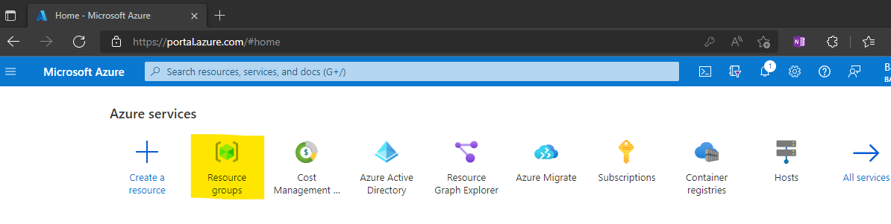

<div class="MCWHeader1">
Autonomous Systems with Bonsai
</div>

<div class="MCWHeader2">
Hands-on lab step-by-step
</div>

<div class="MCWHeader3">
April 2022
</div>

Information in this document, including URL and other Internet website references, is subject to change without notice. Unless otherwise noted, the example companies, organizations, products, domain names, e-mail addresses, logos, people, places, and events depicted herein are fictitious, and no association with any real company, organization, product, domain name, e-mail address, logo, person, place or event is intended or should be inferred. Complying with all applicable copyright laws is the responsibility of the user. Without limiting the rights under copyright, no part of this document may be reproduced, stored in or introduced into a retrieval system, or transmitted in any form or by any means (electronic, mechanical, photocopying, recording, or otherwise), or for any purpose, without the express written permission of Microsoft Corporation.

Microsoft may have patents, patent applications, trademarks, copyrights, or other intellectual property rights covering subject matter in this document. Except as expressly provided in any written license agreement from Microsoft, the furnishing of this document does not give you any license to these patents, trademarks, copyrights, or other intellectual property.

The names of manufacturers, products, or URLs are provided for informational purposes only and Microsoft makes no representations and warranties, either expressed, implied, or statutory, regarding these manufacturers or the use of the products with any Microsoft technologies. The inclusion of a manufacturer or product does not imply endorsement of Microsoft of the manufacturer or product. Links may be provided to third-party sites. Such sites are not under the control of Microsoft and Microsoft is not responsible for the contents of any linked site or any link contained in a linked site, or any changes or updates to such sites. Microsoft is not responsible for webcasting or any other form of transmission received from any linked site. Microsoft is providing these links to you only as a convenience, and the inclusion of any link does not imply endorsement of Microsoft of the site or the products contained therein.

© 2022 Microsoft Corporation. All rights reserved.

Microsoft and the trademarks listed at <https://www.microsoft.com/en-us/legal/intellectualproperty/trademarks> are trademarks of the Microsoft group of companies. All other trademarks are property of their respective owners.

**Contents**

<!-- TOC -->

- [Autonomous Systems with Bonsai hands-on lab step-by-step](#autonomous-systems-with-bonsai-hands-on-lab-step-by-step)
  - [Abstract and learning objectives](#abstract-and-learning-objectives)
  - [Overview](#overview)
  - [Solution architecture](#solution-architecture)
  - [Requirements](#requirements)
  - [Before the hands-on lab](#before-the-hands-on-lab)
 - [Exercise 1: Creating the Brain](#exercise-1-creating-the-brain)
    - [Task 1: Set up Bonsai on Azure](#task-1-set-up-bonsai-on-azure)
    - [Task 2: Creating a Brian](#task-2-creating-a-brain)
    - [Task 3: Adding Inkling Code](#task-3-adding-inkling-code)
 - [Exercise 2: Creating the Simulator in Bonsai](#exercise-2-creating-a-simulator)
    - [Task 1: Set up Cloud Infrastructure](#task-1-set-up-cloud-infrastructure)
    - [Task 2: Deploy to Azure Web Application](#task-2-deploy-to-azure-web-application)
    - [Task 3: Continuous Deployment with GitHub Actions](#task-3-continuous-deployment-with-github-actions)
    - [Task 4: Branch Policies in GitHub (Optional)](#task-4-branch-policies-in-github-optional)
 - [Exercise 3: Training, Assessment, optimization](#exercise-3-training-assessment-optimization)
    - [Task 1: Set up Application Insights](#task-1-set-up-application-insights)
    - [Task 2: Linking Git commits to Azure DevOps issues](#task-2-linking-git-commits-to-azure-devops-issues)
    - [Task 3: Continuous Deployment with Azure DevOps Pipelines](#task-3-continuous-deployment-with-azure-devops-pipelines)
 - [Exercise 4: Deploying the brain](#exercise-3-deploying-the-brin)
    - [Task 1: Set up Application Insights](#task-1-set-up-application-insights)
    - [Task 2: Linking Git commits to Azure DevOps issues](#task-2-linking-git-commits-to-azure-devops-issues)
    - [Task 3: Continuous Deployment with Azure DevOps Pipelines](#task-3-continuous-deployment-with-azure-devops-pipelines)
- [After the hands-on lab](#after-the-hands-on-lab)
    - [Task 1: Tear down Azure Resources](#task-1-tear-down-azure-resources)

<!-- /TOC -->

# Autonomous Systems with Bonsai hands-on lab step-by-step

## Abstract and learning objectives

In this hands-on lab, you will learn how to implement a solution with a combination of Bonsai Tool Chain and Python simulatorn to optimization is the Continuous Stirred Tank Reactor using  machine teaching and deep reinforcement learning.

At the end of this workshop, you will be better able to implement solutions for autonomous systems with Bonsai Tool Chain in Azure, using Inkling, a Python Simulator, and the Bonsai UI platform.

## Overview

Contoso is world wide leader in gases, chemicals and services. It's main factory creates 60% of the chemicals needed for industry and manufacturing as well as agriculture.

Contos has been going through a digital transformation and is looking to embrace AI and Autonomous systems for it's Chemial processing plant in order to improve both safety and optimize production. One of the primary targets for optimization is the Continuous Stirred Tank Reactor (CSTR). This reactor is essentially a tank that has a stirring apparatus to continuously mix reactants inside and continuously manufacture a chemical product.

One of the concerns regarding this CSTR is that the chemical reaction happening inside is exothermic, meaning it produces heat. As a result, the reactor temperature must be controlled to prevent thermal runaway, when the reactor becomes uncontrollably hot. The CSTR needs to operate under transient and steady state conditions. During continuous steady-state operation, the CSTR is producing a specified product. When the CSTR is starting up or transitioning to produce different products, it is in transient state. During transient state, it is difficult to control the reactor to reach the target concentration of the product while preventing thermal runaway.

## Solution architecture


## Requirements

1. Microsoft Azure subscription must be pay-as-you-go or MSDN.
   - Trial subscriptions will _not_ work.
   - To complete this lab setup, ensure your account includes the following:
     - Has the [Owner](https://docs.microsoft.com/azure/role-based-access-control/built-in-roles#owner) built-in role for the subscription you use.
     - Is a [Member](https://docs.microsoft.com/azure/active-directory/fundamentals/users-default-permissions#member-and-guest-users) user in the Azure AD tenant you use. (Guest users will not have the necessary permissions.)


## Before the hands-on lab

You should follow all steps in the [Before the hands-on lab setup guide](Before%20the%20HOL%20-%20Continuous%20delivery%20in%20Azure%20DevOps.md) *before* performing the Hands-on lab. Pay close attention to product versions, as the version numbers called out in the lab have been tested and shown successful for the lab.

## Exercise 1: Creating the Brain

Duration: 40 minutes

After a requirements gathering effort, Contoso has decided to use the Bonsai platform to optimize their CSTR process.  They will be optimizing for avoiding thermal runaway as well as minimize concentration reference.

**Help references**

|                                       |                                                                        |
| ------------------------------------- | ---------------------------------------------------------------------- |
| **Description**                       | **Link**                                                              |
| One Dev Minute - What is Autonomous Systems? | <https://youtu.be/U0ztL-bncCU> |
| What is Project Bonsai? | <https://www.youtube.com/watch?v=YjnL5-48T6s> |
| Microsoft Learn - Introduction to Microsoft Project Bonsai | <https://docs.microsoft.com/en-us/learn/modules/intro-to-project-bonsai/> |
| Microsoft Docs - What is Project Bonsai? | <https://docs.microsoft.com/en-us/bonsai/product/> |

### Task 1: Set up Bonsai on Azure

You are going to set the Resource group, create Bonsai Tool Chain, and open Bonsai UI.

1. Log into your Azure subscription.

2. Select Resource group:



3. Select Create:


4. Name your Resourcegroup and select the subscription and region, select review + create.  NOTE that your subscription name will vary.  Note also that Bonsai is only available in US West Geo.


5. Validation should pass.  Create the resource group.


6. Navigate to the Resource Group (using pop-up after create completes). Search for Bonsai. Create a Bonsai service.  This should take a few minutes.


7. Navigate to Bonsai (using pop-up after create completes). Search for Bonsai. Select Launch Bonsai Workspace. You might be prompted for a password.  Congratulations, you have now created a Bonsai Service!


### Task 2: Creating a Brain

Now that we have have the Bonsai Service deployed, we will start with creating a Brain.

1. From the Bonsai UI environment, select Create Brain:


2. Name your Brain, and select OK.  You will see an empty Brain created and an error that you cannot train the brain.  This is because your Brain is empty :-D.


### Task 3: Adding Inkling Code

Now that we have the Bonsai UI and we have successfully created a Bonsai Brain, let's start with adding some code. Bonsai uses Inkling language.  The idea is to provide a high level language that is easy to understand and use.
1. Define some simulator constants.  A Bonsai Brain has to Learn in order to be able to act later.  In order for it to learn, it uses a Simulator.  We will be adding a Simulator in the next excercise, however we can define the simulator inputs and ouputs in this section.  
 We define:
	i. The desired concentration
	ii. The current concentration
	iii. The current temperature
	iv. The desired temprature
	v. The coolant absolute temprature 
	
We also define some contants for limits on concentration and temprature.
Finally, we define a SimState - this is the structure that will be used as an input for the Brain.
Add the following code outside the graph block, and below the "using" statements:

```text
# Limits for concentration
const conc_max = 12
const conc_min = 0

# Limits for reactor temperature
const temp_max = 800
const temp_min = 10

# State received from the simulator after each iteration
type SimState {
    Cr: number<conc_min .. conc_max>,         # Concentration: Real-time reactor read
    Tr: number<temp_min .. temp_max>,         # Temperature: Real-time reactor read
    Cref: number<conc_min .. conc_max>,       # Concentration: Target reference to follow
    Tref: number<temp_min .. temp_max>,       # Temperature: Target reference to follow
    Tc: number<temp_min .. temp_max>,         # Coolant absolute temperature as input to the simulation
}

```
2. Now, we define the Observable State.  The Brain uses the Observable State as a graph input to make a descision on what action to take.  

```text
# State which are used to train brain
type ObservableState {
    Cr: number<conc_min .. conc_max>,         # Concentration: Real-time reactor read
    Tr: number<temp_min .. temp_max>,         # Temperature: Real-time reactor read
    Cref: number<conc_min .. conc_max>,       # Concentration: Target reference to follow
    Tc: number<temp_min .. temp_max>,         # Coolant absolute temperature as input to the simulation
}

```

3. Let's add some initial code.  Note that this won't compile just yet.  The first step is to add a Concept.  A concept is something the brain will learn from.  Our first concept is ModifyConcentration.  Note that this is the primary function of a CSTR.  We will represent it by setting a couple of goals. In order to do that, we define a curriculum that encapsulates the two goals we are setting here - to optimize the concentration, and avoid thermal runaway.  Notice the goal to bring the concentratio is to compare the desired concentration vs. the actual, and try to bring it within a 0.25 range.  The second goal is to avoid tempratures above 400.

```text
graph (input: ObservableState) {
    concept ModifyConcentration(input):SimAction {
        curriculum {

            # The objective of training is expressed as 2 goals
            # (1) drive concentration close to reference
            # (2) avoid temperature going beyond limit
            goal (State: SimState) {
                minimize `Concentration Reference` weight 1:
                    Math.Abs(State.Cref - State.Cr)
                    in Goal.RangeBelow(0.25)
                avoid `Thermal Runaway` weight 4:
                    Math.Abs(State.Tr)
                    in Goal.RangeAbove(400)
            }
        }        
    }
}
```
4. Notice that in our code we indicate that the Graph output is a SimAction. This is the meat of the Brain - to make a sequential descision based on a given observale state.  So let's define a SimAction now, along with some constants.  Tc_adjust tells the simulator adjust the temprature by.
NOTE that this needs to be above the graph block.

```text
const Ts = 0.5 # Sim Period
const coolant_temp_deriv_limit_per_min = 10 # Coolant temperature derivative limit per minute
const coolant_temp_deriv_limit = Ts * coolant_temp_deriv_limit_per_min

# Action provided as output by policy and sent as to the simulator
type SimAction {
    # Delta to be applied to initial coolant temp (absolutely, not per-iteration)
    Tc_adjust: number<-coolant_temp_deriv_limit .. coolant_temp_deriv_limit>
}

```
5. At this time, you should get a warning about the curriculum not having a source.  In order to learn, we need a source (a simulator) to learn from.  Let's go ahead and define that outside the graph block:

```text
simulator CSTRSimulator(Action: SimAction): SimState {
    # Automatically launch the simulator with this registered package name.
    package "CSTR"
}
```

And modify the curriculum by adding the following line in the curriculum block:

```text

source CSTRSimulator

```

6. At this point, you should have inkling code that compiles (no errors) however, if you hit the train button, it should give you a warning, "CSTR" package not found.  We will be adding the simulator in the next section.


## Exercise 2: Create a Simulator

Duration: 40 minutes

Now that we have created the Bonsai Service and written some inkling code, let's work wtih the Simulator.  In this case, Contoso Chemicals is using a Mathlab simulator in oder to simulate the conditions within a CSTR process.

**Help references**

|                                       |                                                                        |
| ------------------------------------- | ---------------------------------------------------------------------- |
| **Description**                       | **Link**                                                              |
| What is Training Simulations for Bonsai? | <https://docs.microsoft.com/en-us/bonsai/product/components/simulation> |

### Task 1: Create a Simulator

First, we need to create the Simulator to use with our Brain.  In this case, we will be using an already created Simulator using MatLab.

1. In a web browser, go to the following github repo:

```Text
https://github.com/microsoft/bonsai-cstr
```

2. Select the "Code" -> "Download Zip"


3. From the Bonsai UI, select the Add Simulator button


4. From the poup, select "MathWorks Simulink":


5. Upload the Zip file downloaded in step 2.


6. Make sure to choose a unique and meaningful name.  This name will be used in the inkling code as a reference. You may also, depending on your budget, set the Memory, core requirements and max instances.  Note that this is the data that will be used to stand up instances of simulators while training the brain.


7. After you select the Create Simulator, you should see a new Simulator added that looks something like this:


Note that you should be able to see the definition of SimState, SimAction and SimConfig.  The SimState and SimAction should match exactly with the way we defined it.  The additional SimConfig section needs to be added to the Inkling code.

### Task 2: Connect to Bonsai Brain

Once you have a Simulator setup, you will need to update the inkling code to connect to the "real" simulator. 

1. Navigate to the Brain you created in the previous excercise.  Edit the curricum, change the source to what you named the Simulator as follows:

    ```text
    package "CSTRSim42"
    ```

2. Add the SimConfig definition from the Simulator code outside the graph block.  Note that the Cref_signal is a numeric value, used by the Simulator.  We define it as a rage between 1 & 5, stepping 1 at a time. The noise_percentage is a rnage between 0 & 100.

    ```text
    # Per-episode configuration that can be sent to the simulator.
	# All iterations within an episode will use the same configuration.
	type SimConfig {
		# Scenario to be run - 5 scenarios: 1-based INT
		# > 1: Concentration transition --> 8.57 to 2.000 - 0 min delay
		# > 2: Concentration transition --> 8.57 to 2.000 - 10 min delay 
		# > 3: Concentration transition --> 8.57 to 2.000 - 20 min delay
		# > 4: Concentration transition --> 8.57 to 2.000 - 30 min delay
		# > 5: Steady State --> 8.57
		Cref_signal: number<1 .. 5 step 1>,
		noise_percentage: number<0 .. 100>  # Percentage of noise to include
	}
    ```
3. At this point, you should be able to train the brain by clicking the green button:


## Exercise 3: Training, Assessments, Optimization

Duration: 40 minutes

At this point, you should be able to train the brain.  

### Task 1: Set up Application Insights

In this task, we will set up Application Insights to gain some insights on how our site is being used and assist in debugging if we run into issues.

1. Open the `deploy-appinsights.ps1` PowerShell script in the `infrastructure` folder of your lab files GitHub repository and add the same custom lowercase three-letter abbreviation we used in step 1 for the `$studentsuffix` variable on the first line.

    ```pwsh
    $studentsuffix = "Your 3 letter abbreviation here"
    $resourcegroupName = "fabmedical-rg-" + $studentsuffix
    $location1 = "westeurope"
    $appInsights = "fabmedicalai-" + $studentsuffix
    ```

2. Run the `deploy-appinsights.ps1` PowerShell script from a PowerShell terminal and save the `AI Instrumentation Key` specified in the output - we will need it for a later step.

    ```bash
    The installed extension 'application-insights' is in preview.
    AI Instrumentation Key="55cade0c-197e-4489-961c-51e2e6423ea2"
    ```

3. Navigate to the `./content-web` folder in your GitHub lab files repository and execute the following to install JavaScript support for Application Insights via NPM to the web application frontend.

    ```bash
    npm install applicationinsights --save
    ```

4. Modify the file `./content-web/app.js` to reflect the following to add and configure Application Insights for the web application frontend.

    ```js
    const express = require('express');
    const http = require('http');
    const path = require('path');
    const request = require('request');

    const app = express();

    const appInsights = require("applicationinsights");         # <-- Add these lines here
    appInsights.setup("55cade0c-197e-4489-961c-51e2e6423ea2");  # <-- Make sure AI Inst. Key matches
    appInsights.start();                                        # <-- key from step 2.

    app.use(express.static(path.join(__dirname, 'dist/content-web')));
    const contentApiUrl = process.env.CONTENT_API_URL || "http://localhost:3001";
    ```

5. Add and commit changes to your GitHub lab-files repository. From the root of the repository, execute the following:

    ```pwsh
    git add .
    git commit -m "Added Application Insights"
    git push
    ```

6. Wait for the GitHub Actions for your lab files repository to complete before executing the next step.

7. Redeploy the web application by running the `deploy-webapp.ps1` PowerShell script from the `infrastructure` folder.

8. Visit the deployed website and check Application Insights in [the Azure portal](https://portal.azure.com) to see instrumentation data.

### Task 2: Linking Git commits to Azure DevOps issues

In this task, you will create an issue in Azure DevOps and link a Git pull request from GitHub to the Azure DevOps issue. This uses the Azure Boards integration that was set up in the Before Hands on Lab.

1. Create a new issue for modifying the README.md in Azure Boards

    

    > **Note**: Make note of the issue number, as you will need it for a later step.

2. Create a branch from `main` and name it `feature/update-readme`.

    ```pwsh
    git checkout main
    git checkout -b feature/update-readme  # <- This creates the branch and checks it out    
    ```    

3. Make a small change to README.md. Commit the change, and push it to GitHub.

    ```pwsh
    git commit -m "README.md update"
    git push --set-upstream origin feature/update-readme
    ```

4. Create a pull request to merge `feature/update-readme` into `main` in GitHub. Add the annotation `AB#YOUR_ISSUE_NUMBER_FROM_STEP_4` in the description of the pull request to link the GitHub pull request with the new Azure Boards issue in step 4. For example, if your issue number is 2, then your annotation in the pull request description should include `AB#2`.

    > **Note**: The `Docker` build workflow executes as part of the status checks.

5. Select the `Merge pull request` button after the build completes successfully to merge the Pull Request into `main`.

    

    > **Note**: Under normal circumstances, this pull request would be reviewed by someone other than the author of the pull request. For now, use your administrator privileges to force the merge of the pull request.

6. Observe in Azure Boards that the Issue is appropriately linked to the GitHub comment.

    

### Task 3: Continuous Deployment with Azure DevOps Pipelines

> **Note**: This section demonstrates Continuous Deployment via ADO pipelines, which is equivalent to the Continuous Deployment via GitHub Actions demonstrated in Task 2. For this reason, disabling GitHub action here is critical so that both pipelines (ADO & GitHub Actions) don't interfere with each other.
> **Note**: To complete [Exercise 3: Task 3](#task-3-continuous-deployment-with-azure-devops-pipelines), the student will need to request a free grant of parallel jobs in Azure Pipelines via [this form](https://aka.ms/azpipelines-parallelism-request). More information can be found [here regarding changes in Azure Pipelines Grant for Public Projects](https://devblogs.microsoft.com/devops/change-in-azure-pipelines-grant-for-public-projects/)

1. Disable your GitHub Actions by adding the `branches-ignore` property to the existing workflows in your lab files repository (located under the `.github/workflows` folder).

    ```pwsh
    on:
      push:
        branches-ignore:    # <-- Add this list property
          - '**'            # <-- with '**' to disable all branches
    ```

2. Navigate to your Azure DevOps `Fabrikam` project, select the `Project Settings` blade, and open the `Service Connections` tab.

3. Create a new `Docker Registry` service connection and set the values to:

    - Docker Registry: <https://ghcr.io>
    - Docker ID: [GitHub account name]
    - Docker Password: [GitHub Personal Access Token]
    - Service connection name: GitHub Container Registry

    

4. Navigate to your Azure DevOps `Fabrikam` project, select the `Pipelines` blade, and create a new pipeline.

    

5. In the `Connect` tab, choose the `GitHub` selection.

    

6. Select your GitHub lab files repository. Azure DevOps will redirect you to authorize yourself with GitHub. Log in and select the repository that you want to allow Azure DevOps to access.

7. In the `Configure` tab, choose the `Starter Pipeline`.

    

8. Remove all the steps from the YAML. The empty pipeline should look like the following:

    ```yaml
    # Starter pipeline
    # Start with a minimal pipeline that you can customize to build and deploy your code.
    # Add steps that build, run tests, deploy, and more:
    # https://aka.ms/yaml

    trigger:
    - main

    pool:
      vmImage: ubuntu-latest

    steps:
    ```

9. In the sidebar, find the `Docker Compose` task and configure it with the following fields, then select the **Add** button:

    - Container Registry Type: Container Registry
    - Docker Registry Service Connection: GitHub Container Registry (created in step 3)
    - Docker Compose File: **/docker-compose.yml
    - Additional Docker Compose Files: build.docker-compose.yml
    - Action: Build Service Images
    - Additional Image Tags = $(Build.BuildNumber)

    
    

    >**Note**: If the sidebar doesn't appear, you may need to select `Show assistant`.

10. Repeat step 9 and add another `Docker Compose` task and configure it with the following fields:

    - Container Registry Type: Container Registry
    - Docker Registry Service Connection: GitHub Container Registry (created in step 3)
    - Docker Compose File: **/docker-compose.yml
    - Additional Docker Compose Files: build.docker-compose.yml
    - Action: Push Service Images
    - Additional Image Tags = $(Build.BuildNumber)

    >**Note**: Pay close attention to the **Action** in Step 10. This is where it differs from Step 9.

    The YAML should be:

    ```yaml
    # Starter pipeline
    # Start with a minimal pipeline that you can customize to build and deploy your code.
    # Add steps that build, run tests, deploy, and more:
    # https://aka.ms/yaml

    trigger:
    - main

    pool:
    vmImage: ubuntu-latest

    steps:
    - task: DockerCompose@0
    inputs:
        containerregistrytype: 'Container Registry'
        dockerRegistryEndpoint: 'GitHub Container Registry'
        dockerComposeFile: '**/docker-compose.yml'
        additionalDockerComposeFiles: 'build.docker-compose.yml'
        action: 'Push services'
        additionalImageTags: '$(Build.BuildNumber)'
    - task: DockerCompose@0
    inputs:
        containerregistrytype: 'Container Registry'
        dockerRegistryEndpoint: 'GitHub Container Registry'
        dockerComposeFile: '**/docker-compose.yml'
        additionalDockerComposeFiles: 'build.docker-compose.yml'
        action: 'Push services'
        additionalImageTags: '$(Build.BuildNumber)'
    ```

11. Save and run the build. New docker images will be built and pushed to the GitHub package registry.

    >**Note**: You may need to grant permission for the pipeline to use the service connection before the run happens.

    

    If you haven't been granted the parallelism, your job will fail with the following message:

    ```text
    ##[error]No hosted parallelism has been purchased or granted. To request a free parallelism grant, please fill out the following form https://aka.ms/azpipelines-parallelism-request
    ```

    Once parallelism is granted, then your pipeline can run.

12. Navigate to your `Fabrikam` project in Azure DevOps and select the `Project Settings` blade. From there, select the `Service Connections` tab.

13. Create a new `Azure Resource Manager` service connection and choose `Service Principal (automatic)`.

14. Choose your target subscription and resource group and set the `Service Connection` name to `Fabrikam-Azure`. Save the service connection - we will reference it in a later step.

15. Open the build pipeline in `Edit` mode, and then select the `Variables` button on the top-right corner of the pipeline editor. Add a secret variable `CR_PAT`, check the `Keep this value secret` checkbox, and copy the GitHub Personal Access Token from the Before the Hands-on lab guided instruction into the `Value` field. Save the pipeline variable - we will reference it in a later step.

    

16. Modify the build pipeline YAML to split into a build stage and a deploy stage, as follows.

    >**Note**: Pay close attention to the `DeployProd` stage, as you need to add your abbreviation to the `arguments` section.

    ```yaml
    # Starter pipeline
    # Start with a minimal pipeline that you can customize to build and deploy your code.
    # Add steps that build, run tests, deploy, and more:
    # https://aka.ms/yaml

    trigger:
    - main

    pool:
      vmImage: ubuntu-latest

    stages:
    - stage: build
      jobs:
      - job: 'BuildAndPublish'
        displayName: 'Build and Publish'
        steps:
        - task: DockerCompose@0
          inputs:
            containerregistrytype: 'Container Registry'
            dockerRegistryEndpoint: 'GitHub Container Registry'
            dockerComposeFile: '**/docker-compose.yml'
            additionalDockerComposeFiles: 'build.docker-compose.yml'
            action: 'Build services'
            additionalImageTags: '$(Build.BuildNumber)'
        - task: DockerCompose@0
          inputs:
            containerregistrytype: 'Container Registry'
            dockerRegistryEndpoint: 'GitHub Container Registry'
            dockerComposeFile: '**/docker-compose.yml'
            additionalDockerComposeFiles: 'build.docker-compose.yml'
            action: 'Push services'
            additionalImageTags: '$(Build.BuildNumber)'

    - stage: DeployProd
      dependsOn: build
      jobs:
      - deployment: webapp
        environment: production
        strategy:
          runOnce:
            deploy:
              steps:
              - checkout: self

              - powershell: |
                  (gc .\docker-compose.yml) `
                    -replace ':latest',':$(Build.BuildNumber)' | `
                    set-content .\docker-compose.yml
                    
              - task: AzureCLI@2
                inputs:
                  azureSubscription: 'Fabrikam-Azure' # <-- The service
                  scriptType: 'pscore'                # connection from step 14
                  scriptLocation: 'scriptPath'
                  scriptPath: './infrastructure/deploy-webapp.ps1'
                  workingDirectory: ./infrastructure
                  arguments: 'Your 3 letter abbreviation here'         # <-- This should be your custom
                env:                       # lowercase three character 
                  CR_PAT: $(CR_PAT)  # prefix from an earlier exercise.
                                # ^^^^^^
                                # ||||||
                                # The pipeline variable from step 15
    ```

17. Navigate to the `Environments` category with the `Pipelines` blade in the `Fabrikam` project and select the `production` environment.

    

18. From the vertical ellipsis menu button in the top-right corner, select `Approvals and checks`.

    

19. Add an `Approvals` check. Add your account as an `Approver` and create the check.

    

20. Run the build pipeline and note how the pipeline waits before moving to the `DeployProd` stage. You will need to approve the request before the `DeployProd` stage runs.

    

## After the hands-on lab

Duration: 15 minutes

Now that the lab is complete, we need to tear down the Azure resources that we created.

### Task 1: Tear down Azure Resources

Now that the lab is done, we are done with our Azure resources. It is good practice to tear down the resources and avoid incurring costs for unnecessary resources.

1. Open the `teardown-infrastructure.ps1` PowerShell script in the `infrastructure` folder of your GitHub lab files repository and add the same custom lowercase three-letter abbreviation we used in a previous exercise for `$studentprefix` variable on the first line.

    ```pwsh
    $studentprefix ="Your 3 letter abbreviation here"
    $resourcegroupName = "fabmedical-rg-" + $studentprefix

    az ad sp delete --id "fabmedical-$studentprefix"
    az group delete --name $resourceGroupName
    ```

2. Execute the `teardown-infrastructure.ps1` PowerShell script to tear down the Azure resources for this lab.

You should follow all steps provided *after* attending the Hands-on lab.